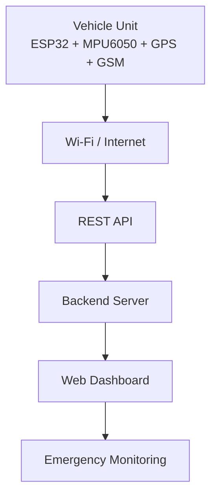
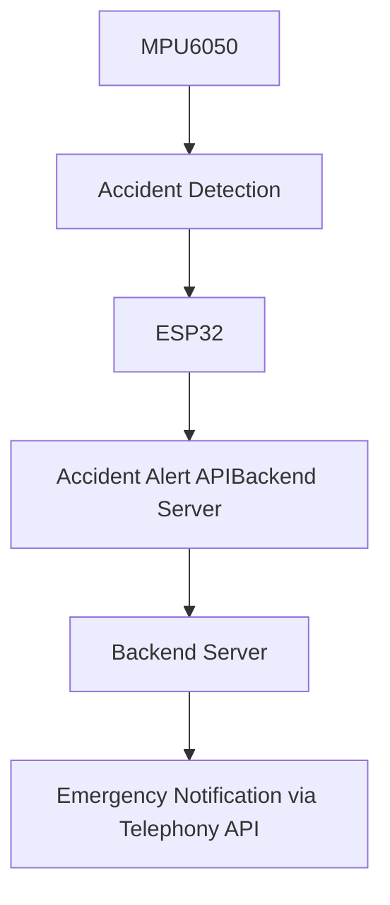
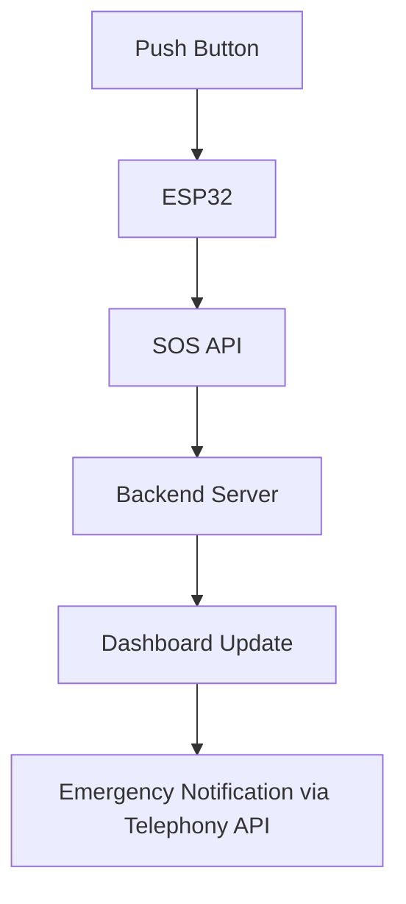

# Backend Architecture

## Overview

The Vehicle Accident Detection and Response System (VADRS) uses a local host-based backend to receive accident alerts, SOS alerts, and vehicle location data from the ESP32 device. The backend acts as an intermediary between the embedded hardware and the web dashboard.

The ESP32 communicates with the backend through HTTPS POST requests over Wi-Fi. The backend processes incoming data and makes it available to authorized users through a web interface.

---

## System Architecture

## Backend Responsibilities

### 1. Accident Alert Processing

When an accident is detected through impact detection or rollover detection, the ESP32 sends an alert packet to the backend.

The backend:

* Receives accident data
* Validates incoming request
* Stores latest location information
* Updates dashboard status
* Initiates emergency notification workflow

---

### 2. SOS Alert Processing

When the user presses the SOS button, the ESP32 sends an SOS request to the backend.

The backend:

* Receives SOS event
* Updates dashboard
* Marks event as high priority
* Initiates emergency response workflow

---

## Data Flow

### Accident Mode

### SOS Mode

---

## API Endpoints

### Accident Alert

POST /api/accident

Purpose:
Receive accident alerts from the vehicle unit.

Sample Payload:

{
"deviceId": "CAR7",
"type": "ACCIDENT",
"latitude": 11.108500,
"longitude": 77.341200
}

---

### SOS Alert

POST /api/sos

Purpose:
Receive manual emergency requests.

Sample Payload:

{
"deviceId": "CAR7",
"latitude": 11.108500,
"longitude": 77.341200
}

---

### Location Retrieval

GET /api/location/{deviceId}

Purpose:
Retrieve the latest known location of the vehicle.

Sample Response:

{
"deviceId": "CAR7",
"latitude": 11.108500,
"longitude": 77.341200,
"status": "ONLINE"
}

---

## Dashboard Features

The web dashboard provides:

* User registration and login
* Vehicle registration
* Accident notifications
* SOS notifications
* Vehicle status monitoring
* Last known location display

---

## Communication Technologies

| Technology | Purpose                    |
| ---------- | -------------------------- |
| Wi-Fi      | Internet Connectivity      |
| HTTPS      | Secure Data Transfer       |
| REST API   | Backend Communication      |
| JSON       | Data Exchange Format       |
| GPS        | Vehicle Location Tracking  |
| GSM        | SMS-Based Emergency Alerts |
| MPU6050    | Accident Detection         |

---

## Future Enhancements

* Cloud database integration
* Historical route storage
* Multiple vehicle support
* Emergency service integration
* Mobile application support
* LoRa-based communication for remote areas
* Analytics dashboard
* Fleet monitoring support

---

## Note

The backend implementation and web dashboard were developed separately from the embedded firmware. This repository focuses primarily on the firmware, hardware design, project documentation, experimental results, and system architecture.
